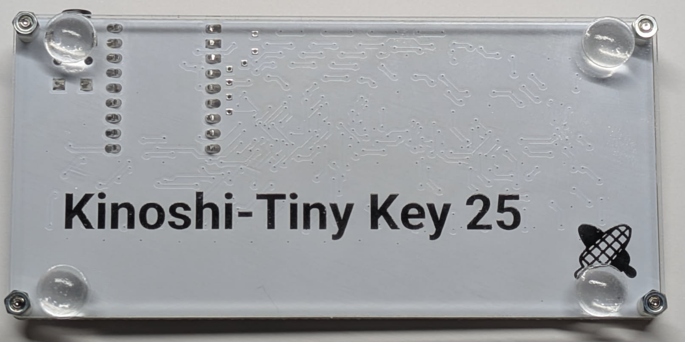

# Kinoshi-Tiny Key 25

## これは何?

- 106mm x 50mm の小さいMIDI コントローラーです。
- USB MIDI(In/Out)、 Legacy MIDI(Out, 3.5mm Type A) の入出力を備えます。
- オクターブ切りかえスイッチ +/-
- Modulation スイッチ
- Pitch Bend スイッチ
- Sustain スイッチ

があります。

- ソースコード/回路を公開しています。必要に応じて、内容を変更することができます。
- バージョンアップで機能を追加する予定です。

## 製品に付属しているもの
- DIN-TRS変換ケーブル(Type A)
- ゴム足(必要に応じてご利用ください)

## 使い方
- 電源はUSB Type-Cケーブルで給電します。モバイルバッテリー、PC/macなどと接続してください。
- USB MIDIは標準ドライバで動作します。別途インストールは不要です。

